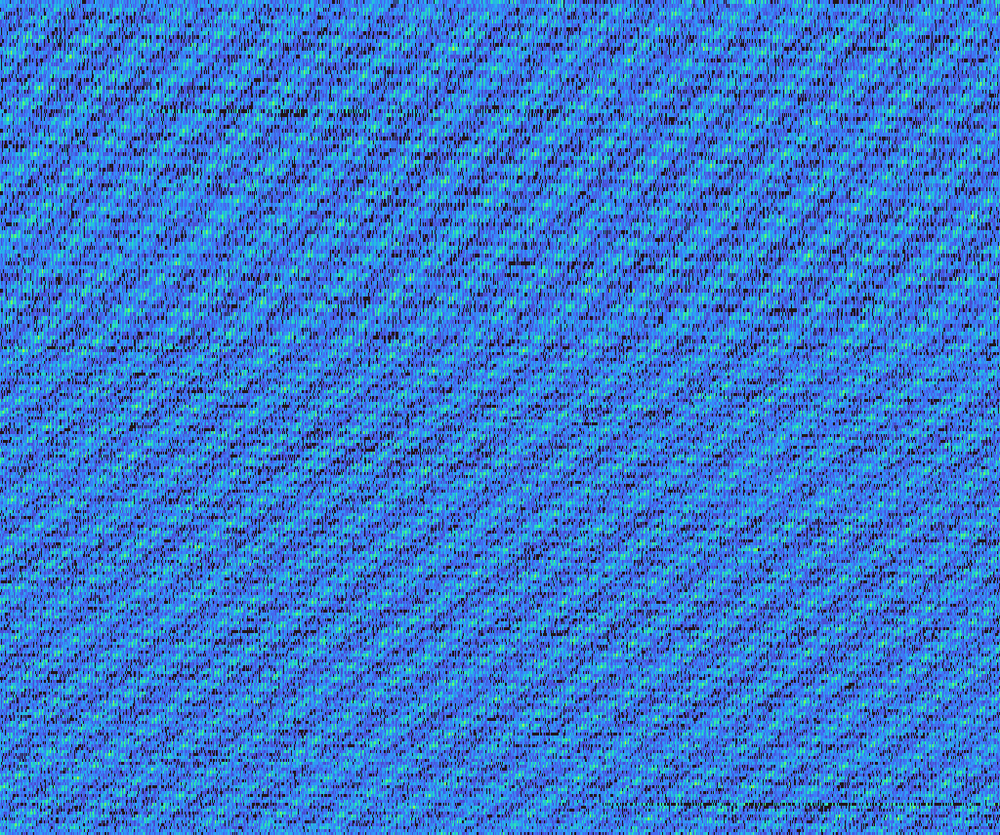
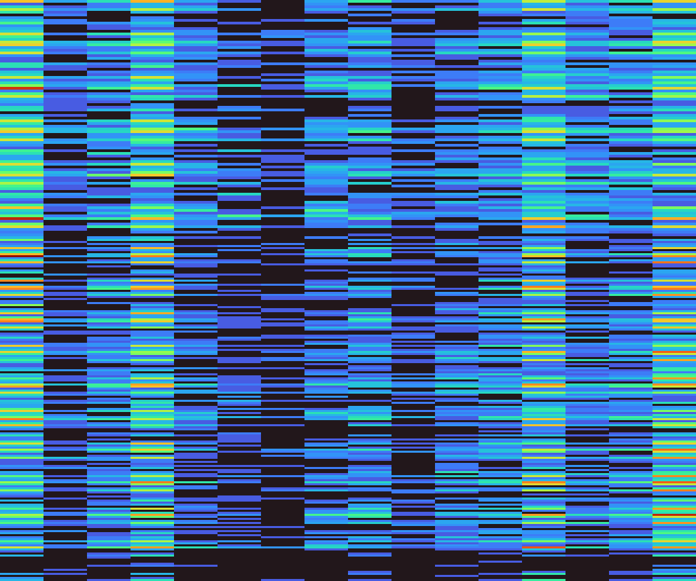

# fw_plot

A command line tool to take the output of fasta windows di/tri/tetranucleotide matrices and make a heatmap. Can be fed the whole TSV, and will automatically group by contig/scaffold/chromosome ID.

The x-axis represents the windows in the genome. The y-axis is the ordered lexicographically by the kmers. So for dinucleotides:

"AA"
"AC"
"AG"
"AT"
"CA"
"CC"
"CG"
"CT"
"GA"
"GC"
"GG"
"GT"
"TA"
"TC"
"TG"
"TT"

Or trinucleotides:

"AAA"
"AAC"
"AAG"
"AAT"
"ACA"
"ACC"
...
"TGA"
"TGC"
"TGG"
"TGT"
"TTA"
"TTC"
"TTG"
"TTT"

## Usage

Build as all rust projects: `cargo build --release`. The executable is in `./target/release/fw_plot`

```
fw_plot 0.1.0
Max Brown <mb39@sanger.ac.uk>
Create fast and simple heatmaps of fasta_windows output.

USAGE:
    fw_plot --outdir <outdir> --tsv <tsv>

FLAGS:
    -h, --help       Prints help information
    -V, --version    Prints version information

OPTIONS:
    -o, --outdir <outdir>    The output directory. [default: .]
    -t, --tsv <tsv>          The TSV file.
```

# Examples

See in the 'images' directory.

SUPER_16 of *Xestia xanthographa*:



And the mitochondrion:



Using a tetranuclotide frequency matrix.