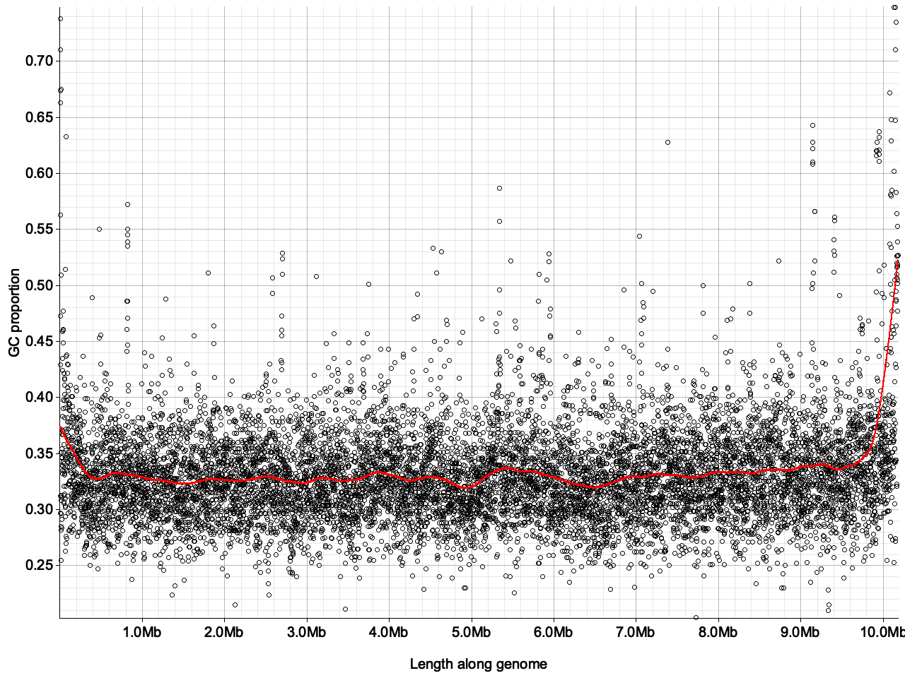
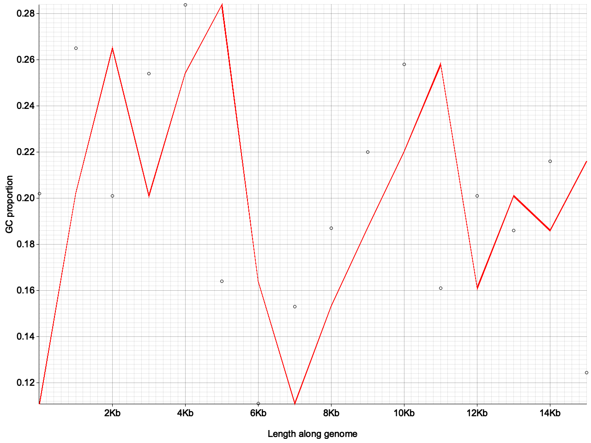

# fw_plot

A command line tool to take the output of fasta windows and make some fast plots. `fw_plot stat [options]` takes the `_windows` output from fasta_windows, and lets you plot any of the calculated variables. `fw_plot heatmap` takes one of the three kmer frequency matrices generated from fasta_windows and makes heatmaps of each of the chromosomes. Note this tool is built upon <a href="https://github.com/tolkit/fasta_windows/tree/v2">fasta_windows version 2</a>.

## Usage

Build as all rust projects: `cargo build --release`. The executable is in `./target/release/fw_plot`.

```
fw_plot 0.1.2
Max Brown <mb39@sanger.ac.uk>
Create fast and simple plots of fasta_windows output.

USAGE:
    fw_plot [SUBCOMMAND]

FLAGS:
    -h, --help       Prints help information
    -V, --version    Prints version information

SUBCOMMANDS:
    corr       Quickly plot correlations between fundamental sequence statistics.
    heatmap    Make a heatmap of the kmer frequencies across chromosomes.
    help       Prints this message or the help of the given subcommand(s)
    stat       Quickly plot fundamental sequence statistics across chromosomes.
```

### Make a heatmap of kmer frequencies

```
fw_plot-heatmap 
Make a heatmap of the kmer frequencies across chromosomes.

USAGE:
    fw_plot heatmap --colour <colour> --outdir <outdir> --tsv <tsv>

FLAGS:
    -h, --help       Prints help information
    -V, --version    Prints version information

OPTIONS:
    -c, --colour <colour>    The colour scale that the heatmap uses. See https://docs.rs/colorous/1.0.5/colorous/.
                             [default: TURBO]  [possible values: TURBO, VIRIDIS, INFERNO, MAGMA, PLASMA, CIVIDIS, WARM,
                             COOL, CUBEHELIX]
    -o, --outdir <outdir>    The output directory. [default: .]
    -t, --tsv <tsv>          The TSV file (..._di/tri/tetranuc_windows.tsv).
```

Note that the y-axis of the heatmap runs from the lexicographically lowest kmers at the bottom of the axis, to the greatest at the top (i.e. AA(AA) will be at the bottom of the plot and TT(TT) at the top).

#### Examples

Run with `fw_plot heatmap -t ilPie_tetranuc_windows.tsv -o ./images`

SUPER_16 of *Xestia xanthographa*:


And the mitochondrion:


### Plot output statistics from fasta_windows

I've added a primitive implementation of a loess fit. *TODO* maybe change style of this slightly. Add user defined params.

```
fw_plot-stat 
Quickly plot fundamental sequence statistics across chromosomes.

USAGE:
    fw_plot stat --loess <loess> --outdir <outdir> --tsv <tsv> --variable <variable>

FLAGS:
    -h, --help       Prints help information
    -V, --version    Prints version information

OPTIONS:
    -l, --loess <loess>          Should a loess fit be added?  [default: false]
    -o, --outdir <outdir>        The output directory. [default: .]
    -t, --tsv <tsv>              The TSV file (..._windows.tsv).
    -v, --variable <variable>    The variable to plot. [possible values: gc_prop, gc_skew, shannon_entropy, prop_gs,
                                 prop_cs, prop_as, prop_ts, prop_ns, dinucleotide_shannon, trinucleotide_shannon,
                                 tetranucleotide_shannon]
```

#### Examples

Run with `fw_plot stat -t ilPie_windows.tsv -v gc_prop -o ./stats -l true`

SUPER_16 GC proportion in *Pieris rapae*:



And in the mitochondrion - the loess fit is not good here!




### Plot correlations from fasta_windows

```
fw_plot-corr 
Quickly plot correlations between fundamental sequence statistics.

USAGE:
    fw_plot corr --outdir <outdir> --tsv <tsv> --x_variable <x_variable> --y_variable <y_variable>

FLAGS:
    -h, --help       Prints help information
    -V, --version    Prints version information

OPTIONS:
    -o, --outdir <outdir>            The output directory. [default: .]
    -t, --tsv <tsv>                  The TSV file (..._windows.tsv).
    -x, --x_variable <x_variable>    The x variable to plot. [possible values: gc_prop, gc_skew, shannon_entropy,
                                     prop_gs, prop_cs, prop_as, prop_ts, prop_ns, dinucleotide_shannon,
                                     trinucleotide_shannon, tetranucleotide_shannon]
    -y, --y_variable <y_variable>    The y variable to plot. [possible values: gc_prop, gc_skew, shannon_entropy,
                                     prop_gs, prop_cs, prop_as, prop_ts, prop_ns, dinucleotide_shannon,
                                     trinucleotide_shannon, tetranucleotide_shannon]
```

#### Examples

Run with `fw_plot corr -t ilPie_windows.tsv -x gc_prop -y tetranucleotide_shannon -o ./corr`

SUPER_16 GC proportion vs tetranucleotide shannon diversity across 1kb windows in *Pieris rapae*:


And in the W:

